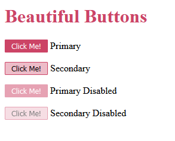

# Learning SASS


## Parent Selector with nesting

### HTML CODE

```
<p>
  <button class='btn btn-primary'>Click Me!</button>
  <label>Primary</label>
</p>

<p>
  <button class='btn btn-secondary'>Click Me!</button>
  <label>Secondary</label>
</p>

<p>
  <button class='btn btn-primary' disabled>Click Me!</button>
  <label>Primary Disabled</label>
</p>

<p>
  <button class='btn btn-secondary' disabled>Click Me!</button>
  <label>Secondary Disabled</label>
</p>
```

### SASS CODE

```
.btn {
  padding: 2px 10px;
  border: 1px solid #c46;
  border-radius: 2px;

  &.btn-primary {      /* & sign indicate parent selector */
    background-color: #c46;
    color: #fff;
    &:disabled {    /* & sign indicate parent selector */
      opacity: 0.5;
    }
  }

  &.btn-secondary {  /* & sign indicate parent selector */
    background-color: #edbcc8;
    color: #000;
    &:disabled {  /* & sign indicate parent selector */
      opacity: 0.5;
    }
  }
}
```


### Produced CSS CODE

```

.btn {
  padding: 2px 10px;
  border: 1px solid #c46;
  border-radius: 2px;
}

.btn.btn-primary {
  background-color: #c46;
  color: #fff;
}

.btn.btn-primary:disabled {
  opacity: 0.5;
}

.btn.btn-secondary {
  background-color: #edbcc8;
  color: #000;
}

.btn.btn-secondary:disabled {
  opacity: 0.5;
}
```

<h3 align="center">Screenhot</h3>
<p align="center">
  
</P>
